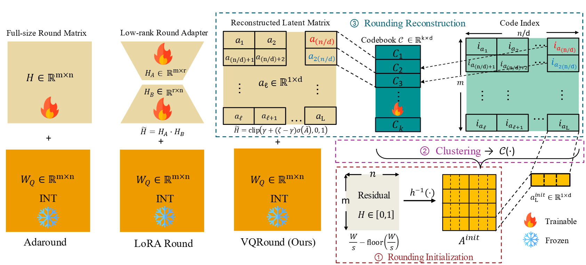

<div align="center">

<h2>
Revisiting Adaptive Rounding with Vectorized Reparameterization for LLM Quantization
</h2>


Yuli Zhou, Qingxuan Chen, Luca Benini, Guolei Sun, Yawei Li*


[](https://huggingface.co/collections/stanzhou/vqround)

</div>

> **Abstract:**  
Adaptive Rounding has emerged as an alternative to round-to-nearest (RTN) for post-training quantization by enabling cross-element error cancellation. Yet, dense and element-wise rounding matrices are prohibitively expensive for billion-parameter large language models (LLMs). We revisit adaptive rounding from an efficiency perspective and propose **VQRound**, a parameter-efficient optimization framework that reparameterizes the rounding matrix into a compact codebook. Unlike low-rank alternatives, VQRound minimizes the element-wise worst-case error under L<sub>∞</sub> norm, which is critical for handling heavy-tailed weight distributions in LLMs. Beyond reparameterization, we identify rounding initialization as a decisive factor and develop a lightweight end-to-end finetuning pipeline that optimizes codebooks across all layers using only 128 samples. Extensive experiments on OPT, LLaMA, LLaMA2, and Qwen3 models demonstrate that VQRound achieves better convergence than traditional adaptive rounding at the same number of steps while using as little as 0.2\% of the trainable parameters. Our results show that adaptive rounding can be made both scalable and fast-fitting. 


## Contents
- [Highlight](#highlight)
- [Install](#install)
- [VQRound Model Zoo](#vqround-model-zoo)
- [Usage](#usage)
- [Citation](#citation)

## Highlight

<p align="center">
    
</p>

**VQRound vs. Prior Adaptive Rounding Methods**

Unlike AdaRound and LoRA Round, VQRound reparameterizes the rounding matrix into compact codebooks.  

- Minimizes element-wise worst-case error under the L<sub>∞</sub> norm
- Uses as few as 0.2% trainable parameters for billion-parameter models
- Supports an end-to-end fine-tuning pipeline as an alternative to traditional block-wise reconstruction  

This design makes adaptive rounding scalable for billion-parameter LLMs.

## Install
```bash
conda create -n vqround python=3.11 -y 
conda activate vqround 
git clone https://github.com/zhoustan/VQRound.git 
cd VQRound 
pip install --upgrade pip 
pip install torch==2.5.1 torchvision --index-url https://download.pytorch.org/whl/cu121
pip install -r requirements.txt
pip install flash-attn --no-build-isolation
conda install conda-forge::faiss-gpu
```

## VQRound Model Zoo
We provide two variants for each supported model:

- **VQRound + RTN**: Direct VQ without GPTQ pre-initialization.
- **VQRound + GPTQ**: Initialized with GPTQ grids and further optimized using VQ.


You can download the pre-trained models you need at [Huggingface](https://huggingface.co/collections/stanzhou/vqround).

| Models  | Sizes                        | W4A16 | W3A16 | W2A16 |
|----------|-----------------------------|--------|--------|--------|
| LLaMA    | 7B/13B                      | ✅     | ✅     | ✅     |
| LLaMA-2  | 7B/13B                      | ✅     | ✅     | ✅     |
| OPT      | 125M/350M/1.3B/2.7B/6.7B/13B | ✅     | ✅     |        |
| Qwen3    | 0.6B/1.7B/4B/8B             | ✅     |        |        |


## Usage
### Train
Example with OPT-125M:
```bash
python main.py \
  --model_path facebook/opt-125m \
  --teacher_model facebook/opt-125m \
  --w_bits 4 \
  --build_teacher_cache
```
If a teacher cache is not provided, it will be built automatically.

You can also explicitly specify a cache path:
```bash
python main.py \
  --model_path facebook/opt-125m \
  --teacher_model facebook/opt-125m \
  --w_bits 4 \
  --teacher_cache cache/teacher_cache.pt \
  --build_teacher_cache
 ```

More detailed and optional arguments:
- `--model_path`: the local model path or huggingface format.
- `--teacher_model`: teacher model for end-to-end distillation.
- `--w_bits`: weight quantization bits.
- `--steps`: number of training steps, 5000 as default.
- `--eval_ppl`: evaluating the perplexity of quantized models.
- `--pre_gptq`: Enable GPTQ grid initialization before VQRound optimization.
- `--gptq_blocksize`: Block size used in GPTQ, 128 as default.
- `--gptq_groupsize`: Group size for GPTQ quantization. Use `-1` for full row quantization.
- `--gptq_percdamp`: Percent dampening factor for GPTQ Hessian approximation.
- `--gptq_sym`: Use symmetric quantization in GPTQ.
- `--gptq_actorder`: Enable activation-ordering heuristic in GPTQ.
- `--D`: Vector dimension for vectorized rounding reparameterization.
- `--K`: Codebook size.
- `--kmeans_iters`: Number of k-means iterations for codebook initialization.

### Test
```bash
python test.py \
  --model_path facebook/opt-125m \
  --load_path <export_dir>
```


## Related Project
[GPTQ: Accurate Post-training Compression for Generative Pretrained Transformers](https://github.com/IST-DASLab/gptq)

## Citation
```bibtex
@inproceedings{zhou2025vqround,
  title={Revisiting Adaptive Rounding with Vectorized Reparameterization for LLM Quantization},
  author={Zhou, Yuli and Chen, Qingxuan and Benini, Luca and Sun, Guolei and Li, Yawei},
  year={2025}
}
```

## Contact

For any questions or issues, feel free to reach out!

**Yuli Zhou**: zhoustan98@gmail.com, **Yawei Li**: yawli@iis.ee.ethz.ch.
